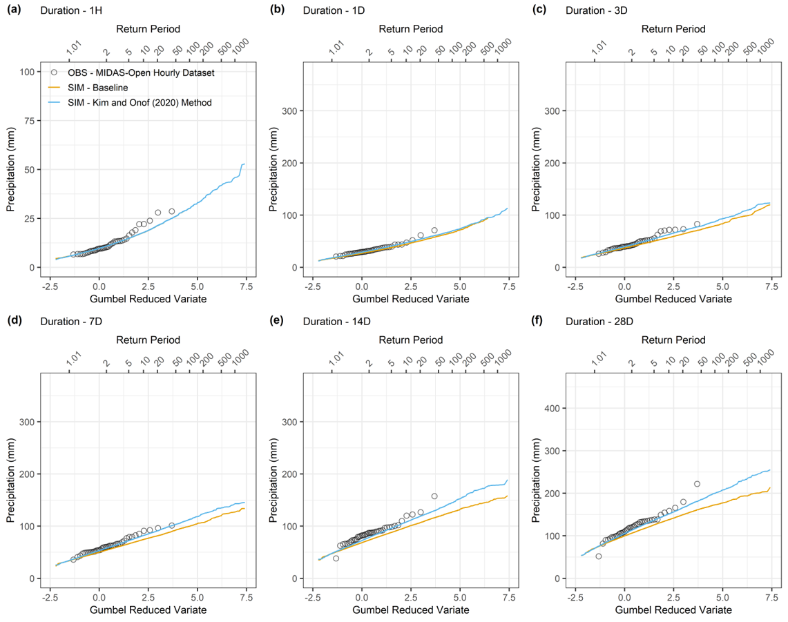

RWGEN
=====

RWGEN is a stochastic spatiotemporal Rainfall and Weather GENerator based on
the Neyman-Scott Rectangular Pulse (NSRP) rainfall model.

RWGEN supports both single site (point) and spatial rainfall simulations. It
can conduct data pre-processing, model fitting, simulation and post-processing.

|

*Example of observed and simulated annual maximum rainfall for different
durations at Heathrow, UK.*

Status
------

The package is new and under active development. It should be considered as a
pre-release for testing at present. Some features may not work properly, but
the core functionality should behave reasonably in most cases. Development of
the rainfall model component is ahead of the weather model component, but the
outputs and behaviour of both should be checked carefully if used in an
application. Parts of the interface may still change.

Installation and Documentation
------------------------------

The package `documentation`_ is also under active development - please check
back regularly for updates. Installation is described in the `documentation`_.

.. _documentation: https://davidpritchard1.github.io/rwgen/html/index.html

UK Input Data
-------------

Selected open data have been pre-processed to help facilitate RWGEN
applications in the UK. Please see the `documentation`_ for details and
download links.

Demo Notebooks
--------------

A `demo`_ version of the rainfall model component can be tried in the browser
without the need for any Python knowledge or installation. To run the model
with your own data, please see the `documentation`_.

.. _demo: https://mybinder.org/v2/gh/davidpritchard1/rwgen-demo/HEAD

Following the link above should load Jupyter in the default browser. If you
navigate into the `examples` folder you should find sub-folders containing the
Jupyter notebooks. These notebooks contain explanations and example usages of
the rainfall model.

Note that the load times for the demo notebook can vary, as it is hosted on the
free `mybinder`_ service. If it is being slow (more than a few minutes), try
closing the tab and reopening (or try again later).

.. _mybinder: https://mybinder.org/

Note also that the demo version currently uses an older version of the rainfall
model with some small differences in the interface.
